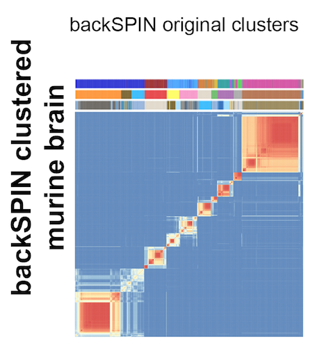

BEARscc - Bayesian ERCC Assessment of Robustness  
================================================

# Summary
Single-cell transcriptome sequencing data are subject to substantial technical variation and batch effects that can confound the classification of cellular sub-types. Unfortunately, current clustering algorithms don't account for this uncertainty. To address this shortcoming, we have developed a noise perturbation algorithm called **BEARscc** that is designed to determine the extent to which classifications by existing clustering algorithms are robust to observed technical variation.

**BEARscc** makes use of ERCC spike-in measurements to model technical variance as a function of gene expression and technical dropout effects on lowly expressed genes. In our benchmarks, we found that BEARscc accurately models read count fluctuations and drop-out effects across transcripts with diverse expression levels. Applying our approach to publicly available single-cell transcriptome data of mouse brain and intestine, we havedemonstrated that BEARscc identified cells that cluster consistently, irrespective of technical variation:



# Installation

Installing BEARscc is easy. You can download a binary package [here](https://bitbucket.org/ludwigbioinf/bearscc/raw/ebfe054be6bac0082adc97ee6774a0b69b32c9c4/builds/BEARscc_0.1.0.tgz). You can then use `install.packages` as normal, but give it the location of the downloaded file:

```R
 install.packages('BEARscc_0.1.0.tgz')
 ```
 

# Usage
 
 _here you should explain how to use the tool!_
 
# License
 This software is made available under the terms of the [GNU General Public License v3](http://www.gnu.org/licenses/gpl-3.0.html)

THE SOFTWARE IS PROVIDED "AS IS", WITHOUT WARRANTY OF ANY KIND, EXPRESS OR IMPLIED, INCLUDING BUT NOT LIMITED TO THE WARRANTIES OF MERCHANTABILITY, FITNESS FOR A PARTICULAR PURPOSE, TITLE AND NON-INFRINGEMENT. IN NO EVENT SHALL THE COPYRIGHT HOLDERS OR ANYONE DISTRIBUTING THE SOFTWARE BE LIABLE FOR ANY DAMAGES OR OTHER LIABILITY, WHETHER IN CONTRACT, TORT OR OTHERWISE, ARISING FROM, OUT OF OR IN CONNECTION WITH THE SOFTWARE OR THE USE OR OTHER DEALINGS IN THE SOFTWARE.
